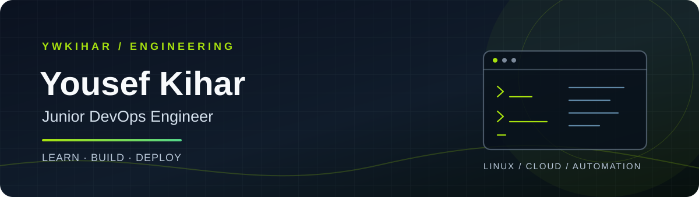
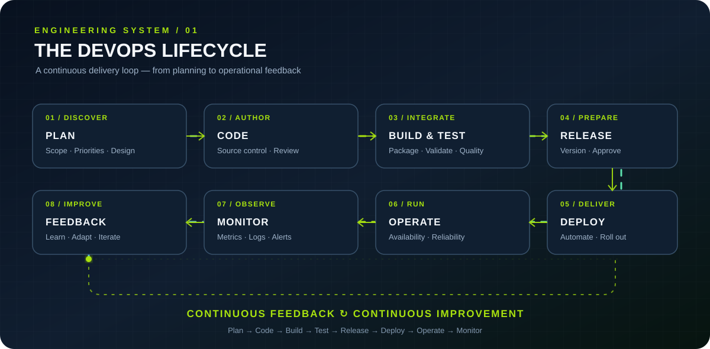

  
  
  

**Linux Systems · Cloud · Automation · CI/CD**

*Learn. Build. Deploy.*

---

## About

I’m a Computer and Information Technology student and DEPI DevOps trainee focused on Linux administration, cloud infrastructure, automation, and reliable application delivery.

I learn by building labs and practical projects, documenting what I implement, and troubleshooting problems methodically. I’m currently expanding my knowledge of cloud platforms, Infrastructure as Code, and observability.

## Technology Stack

### Practical experience

| Area | Current scope |
|---|---|
| Linux Administration | Fedora, Ubuntu, RHEL; packages, services, permissions, SSH |
| Scripting & Version Control | Bash scripting, Git workflows, GitHub |
| Containers | Dockerfiles, image builds, containers, port mapping |
| Configuration Management | Ansible inventories, playbooks, roles |
| Cloud | AWS EC2 setup and application deployment |
| CI/CD | Jenkins labs and pipeline fundamentals |
| Orchestration | Kubernetes lab practice |

### Currently learning

---

## DevOps Lifecycle

Continuous feedback connects operations and monitoring back to planning.

## Featured Projects

<table>
<tr>
<td width="50%" valign="top">

### Ansible Apache Automation

Automates Apache installation, service management, and package removal on Debian/Ubuntu systems.

</td>
<td width="50%" valign="top">

### AWS EC2 Portfolio Deployment

Uses Ansible to configure Apache and publish a portfolio website to an existing AWS EC2 instance.

</td>
</tr>
<tr>
<td width="50%" valign="top">

### Java Exercises

Console-based programming exercises covering fundamentals, input validation, and problem solving.

</td>
<td width="50%" valign="top">

### Current Focus

Cloud fundamentals, Terraform concepts, monitoring, CI/CD workflows, container delivery, and Linux troubleshooting.

</td>
</tr>
</table>

## Learning Roadmap

- Strengthen AWS and Azure cloud fundamentals
- Practice Infrastructure as Code with Terraform
- Explore Prometheus metrics and Grafana dashboards
- Improve CI/CD pipeline implementation
- Build and document reproducible DevOps labs

## GitHub Overview

---

**Open to collaboration, learning, and junior DevOps opportunities.**

Learn continuously. Build thoughtfully. Deliver reliably.

