  
  
  

**Linux · Cloud Infrastructure · Automation · CI/CD**

---

## Professional Summary

Computer and Information Technology student and DEPI DevOps trainee building practical skills in Linux system administration, cloud infrastructure, configuration management, containerization, and CI/CD.

My approach is hands-on and structured: practice in labs, build projects, document implementation details, and troubleshoot systematically. I am interested in helping teams deliver applications through repeatable and maintainable infrastructure workflows.

## Technical Toolkit

 

| Domain | Hands-on scope |
|---|---|
| Linux | Fedora, Ubuntu, RHEL; package and service management, permissions, SSH |
| Shell & Git | Bash scripting, Git workflows, GitHub repositories |
| Containers | Dockerfiles, image builds, containers, port mapping |
| Automation | Ansible inventories, playbooks, roles |
| Cloud | AWS EC2 setup and application deployment |
| CI/CD | Jenkins labs and pipeline fundamentals |
| Orchestration | Kubernetes lab practice |

## DevOps Lifecycle

```mermaid
flowchart LR
    P["01 · PLAN<br/>Define & Prioritize"]
    C["02 · CODE<br/>Version Control"]
    B["03 · BUILD<br/>Package & Integrate"]
    T["04 · TEST<br/>Validate Quality"]
    R["05 · RELEASE<br/>Prepare Delivery"]
    D["06 · DEPLOY<br/>Automate Rollout"]
    O["07 · OPERATE<br/>Run Services"]
    M["08 · MONITOR<br/>Observe & Learn"]

    P --> C --> B --> T --> R --> D --> O --> M
    M -. "Feedback & Continuous Improvement" .-> P

    classDef planning fill:#172334,stroke:#8b9bb0,color:#f8fafc,stroke-width:1.5px
    classDef delivery fill:#172334,stroke:#7cbf12,color:#f8fafc,stroke-width:1.8px
    classDef operations fill:#172334,stroke:#2496ed,color:#f8fafc,stroke-width:1.5px
    class P,C planning
    class B,T,R,D delivery
    class O,M operations

    linkStyle 7 stroke:#a8e20e,stroke-width:2px,stroke-dasharray:5 5
```

  Plan → Code → Build → Test → Release → Deploy → Operate → Monitor → Improve

This lifecycle is iterative: operational feedback and monitoring inform the next planning and engineering cycle.

## Selected Projects

<table>
<tr>
<td width="50%" valign="top">

### Ansible Apache Automation

Ansible playbooks to install Apache, manage its service state, and remove the package on Debian/Ubuntu systems.

</td>
<td width="50%" valign="top">

### AWS EC2 Portfolio Deployment

Deploys a portfolio website to an existing EC2 instance by configuring Apache and publishing site files with Ansible.

</td>
</tr>
<tr>
<td width="50%" valign="top">

### Java Exercises

Console-based exercises covering programming fundamentals, input validation, and problem-solving.

</td>
<td width="50%" valign="top">

### Learning Priorities

Cloud operations, Infrastructure as Code fundamentals, CI/CD implementation, container delivery, and Linux troubleshooting.

</td>
</tr>
</table>

## Development Focus

- AWS infrastructure and cloud operations
- Infrastructure as Code concepts
- CI/CD pipeline design and implementation
- Container-based application delivery
- Linux administration and troubleshooting

## GitHub Metrics

---

**Open to collaboration, continuous learning, and junior DevOps opportunities.**

Learn continuously. Build thoughtfully. Deliver reliably.

