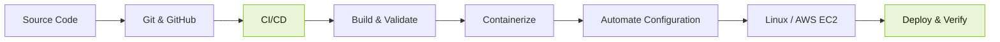

# Yousef Kihar

### Junior DevOps Engineer

**Learn. Build. Deploy.**

Computer & Information Technology Student · DEPI DevOps Trainee  
Egypt

---

## About

I am a Computer and Information Technology student focused on DevOps, Linux system administration, cloud infrastructure, and automation.

I build hands-on projects to strengthen my skills in deployment workflows, containerization, configuration management, and CI/CD. I value clear documentation, practical problem-solving, and continuous improvement.

## Technical Skills

| Area | Tools and Technologies |
|---|---|
| Operating Systems | Linux (Fedora, Ubuntu, RHEL) |
| Scripting | Bash |
| Version Control | Git, GitHub |
| Containers | Docker |
| Configuration Management | Ansible |
| Cloud | AWS EC2 |
| CI/CD | Jenkins (practical labs) |
| Orchestration | Kubernetes (lab experience) |

## Delivery Workflow

## Selected Projects

### Ansible Apache Automation
Automates Apache installation, service configuration, and removal with Ansible playbooks.

[View repository](https://github.com/YWKihar/ansible-apache-automation)

### AWS EC2 Portfolio Deployment
Uses Ansible to configure an existing AWS EC2 instance and deploy a portfolio website with Apache.

[View repository](https://github.com/YWKihar/aws-ec2-ansible-portfolio)

### Java Exercises
Beginner Java console exercises covering programming fundamentals and problem-solving.

[View repository](https://github.com/YWKihar/Java-Exercises)

## Current Learning Focus

- AWS cloud infrastructure fundamentals
- Infrastructure as Code concepts
- CI/CD pipeline design
- Containerization and deployment practices
- Linux administration and troubleshooting

## Connect

- GitHub: [@YWKihar](https://github.com/YWKihar)

---

Continuous learning. Practical engineering. Reliable delivery.

